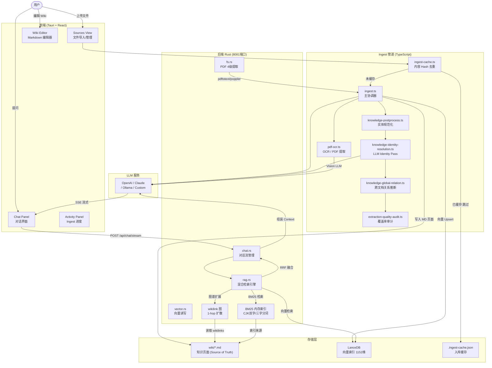
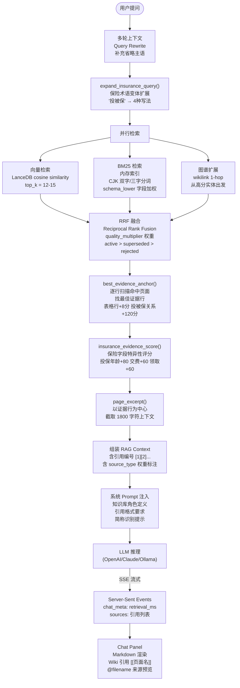
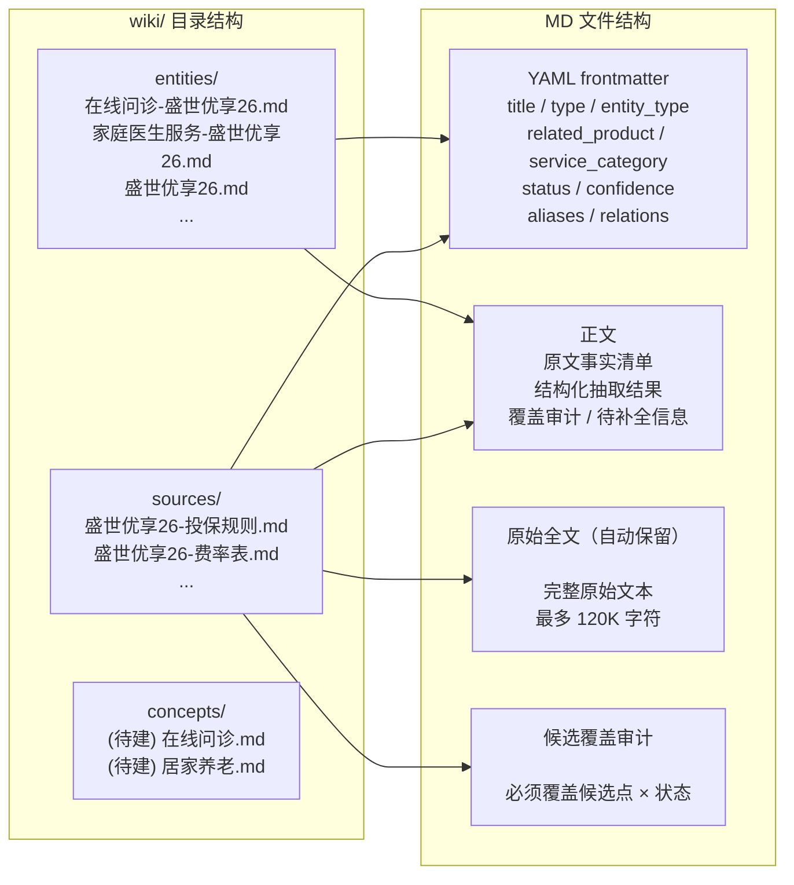

# LLM Wiki — 系统架构与流程图

> 基于 `feature/schema-v2-service-category` 分支（`b6c38cb` 基础）  
> 更新时间：2026-06-09

---

## 一、整体系统架构



---

## 二、Ingest 抽取详细流程

```mermaid
flowchart TD
    START([用户上传文件]) --> HASH{内容 Hash\n命中缓存?}
    HASH -->|已缓存且内容未变| SKIP([跳过 返回缓存路径])
    HASH -->|未缓存 / 内容变更| TYPE{文件类型?}

    TYPE -->|".json"| JSON_PATH["fastIngestJsonSource()\n确定性 JSON 解析\n不调用 LLM"]
    TYPE -->|".pdf"| PDF_PATH["四级 PDF 提取\n①pdf-extract 直接提取\n②pdftotext (≥200字符则用)\n③OCR Vision LLM\n④图片 pages marker"]
    TYPE -->|"图片 .png/.jpg..."| IMG_PATH["ocrImageBytes()\nVision LLM OCR"]
    TYPE -->|"文本 .md/.txt"| TEXT_PATH["直接读取文本"]

    JSON_PATH --> JSON_WRITE["生成确定性 source 页面\n字段表 + 产品元数据"]
    JSON_WRITE --> EMBED_ONLY

    PDF_PATH --> CONTENT["sourceContent = 提取文本"]
    IMG_PATH --> CONTENT
    TEXT_PATH --> CONTENT

    CONTENT --> SIZE{文本长度?}
    SIZE -->|"< 50K 字符"| DIRECT["直接模式\n整体送 LLM"]
    SIZE -->|"> 50K 字符"| HIER["层级分块模式\nchunkMarkdown()\n按语义切 chunk\n每块 10K-22K 字符"]

    DIRECT --> BUILD_CTX["构建 LLM 提示上下文"]
    HIER -->|每块迭代| BUILD_CTX

    BUILD_CTX --> CTX1["Schema 候选清单\nbuildSchemaCandidateManifest()\n最多 80 个候选"]
    BUILD_CTX --> CTX2["文档类型信号检测\nbuildInsuranceExtractionChecklist()\n产品条款/服务手册/案例/话术..."]
    BUILD_CTX --> CTX3["证据层要求\nbuildFactLayerHints()\nOCR/表格行 → 双层结构"]
    BUILD_CTX --> CTX4["服务手册节点指令\nbuildServiceManualNodeDirective()\n28个已知服务权益节点"]

    CTX1 & CTX2 & CTX3 & CTX4 --> STAGE1["LLM Stage 1: 分析\n理解文档类型/重点/结构"]

    STAGE1 --> STAGE2["LLM Stage 2: 生成\n输出 FILE 块格式"]

    STAGE2 --> PARSE["parseFileBlocks()\n解析 ---FILE: path--- 块\n处理 CRLF/截断/fence/路径注入"]

    PARSE --> SAFE{isSafeIngestPath()\n路径安全检查}
    SAFE -->|危险路径| WARN["⚠️ 警告 丢弃此块"]
    SAFE -->|安全路径| WRITE["写入 wiki/*.md"]

    WRITE --> NORM["normalizeEntityBlock()\n实体规范化"]
    NORM --> RESOLVE["resolveIncomingKnowledgePage()\nSource权威性冲突仲裁\nregulatory_doc:100 > product_terms:95"]

    RESOLVE --> OCR_PRESERVE["preserveOcrDetailsInSourcePage()\n追加 原始全文 区块\n最多保留 120K 字符"]

    OCR_PRESERVE --> POST["runKnowledgePostProcess()\nDomainSkillRegistry 分发\nHealthServiceSkill 等"]

    POST --> IDENTITY["runIdentityPass()\nLLM 4阶段身份解析\n① buildIdentityCatalog\n② generateIdentityCandidates\n③ llmJudgeIdentityPairs (15对/次)\n④ applyIdentityJudgments"]

    IDENTITY --> GLOBAL_REL["runGlobalRelationPass()\n跨文档关系推断\n自动生成 has_part / applies_to 等"]

    GLOBAL_REL --> AUDIT["writeExtractionQualityAudit()\n覆盖率分 + 待补全清单\n写入 source 页面"]

    AUDIT --> EMBED_ONLY["embedWrittenIngestPages()\n向量 Upsert 到 LanceDB\n1152维 embedding"]

    EMBED_ONLY --> CACHE_SAVE["saveIngestCache()\ncontent hash 为 key\n保存写入路径"]

    CACHE_SAVE --> DONE([✅ 完成])
```

---

## 三、RAG 检索与对话流程



---

## 四、知识存储与文件结构



---

> 图表基于 v1.3（`b6c38cb`）代码实际实现绘制，不含 v2.0 计划功能（ServiceCategory 节点等）。  
> 维护者：Claude (Antigravity)
