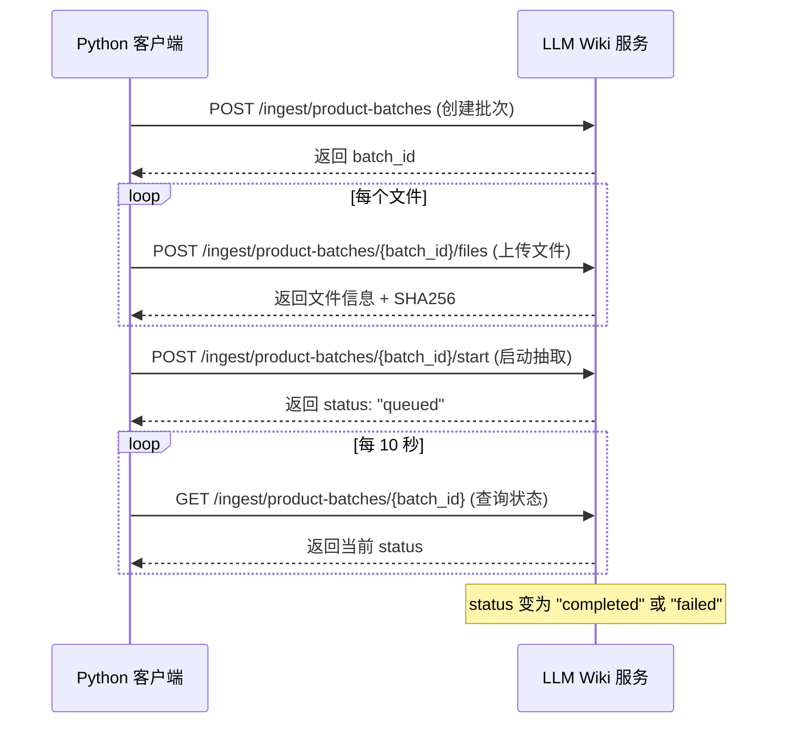

# LLM Wiki 产品批量导入 API 文档

> 版本: 0.5.0 | 更新时间: 2026-07-01

## 基本信息

| 项目 | 值 |
|------|---|
| Base URL | `http://{服务器IP}:8231/api` |
| 协议 | HTTP/1.1 |
| 编码 | UTF-8 |
| 鉴权 | 当前无需鉴权 |

---

## 一、服务健康检查

### `GET /api/health`

验证服务是否正常运行。

**响应示例：**
```json
{ "service": "llm-wiki", "status": "ok" }
```

**Python 示例：**
```python
import requests

API_BASE = "http://192.168.1.100:8231/api"

r = requests.get(f"{API_BASE}/health", timeout=5)
print(r.json())  # {'service': 'llm-wiki', 'status': 'ok'}
```

---

## 二、产品批量导入接口

### 完整流程

```
创建批次 → 上传文件(多次) → 启动抽取 → 轮询状态
```



---

### 2.1 创建批次

#### `POST /api/ingest/product-batches`

**Content-Type:** `application/json`

**请求体：**

| 字段 | 类型 | 必填 | 说明 |
|------|------|:----:|------|
| `project_name` | string | ✅ | 项目名称（必须在前端已创建） |
| `product_name` | string | ✅ | 产品名称，如"平安e生保（尊享版）医疗保险" |
| `insurance_category` | string | ✅ | 险种分类，见下方枚举 |
| `product_code` | string | ❌ | 产品代码，如"596" |
| `duplicate_policy` | string | ❌ | 重复策略，默认 `"merge"`（合并） |
| `client_batch_id` | string | ❌ | 调用方自定义批次ID，用于幂等去重 |
| `section_parallel` | int | ❌ | 单产品内 section 级 LLM 并发数（1~32），覆盖服务端环境变量。不传则用服务端默认值 4 |

**insurance_category 可选值：**

```
医疗险 | 重疾险 | 寿险 | 意外险 | 意外医疗险 | 年金险
```

**请求示例：**
```python
# 基本用法
resp = requests.post(f"{API_BASE}/ingest/product-batches", json={
    "project_name": "平安产品知识库",
    "product_name": "平安e生保（尊享版）医疗保险",
    "insurance_category": "医疗险",
    "product_code": "596",
    "duplicate_policy": "merge",
    # 可选：内网模型支持并发时传入，加快单个产品解析速度
    # "section_parallel": 6,   # 1=串行, 4=默认, 6~10=内网高并发场景, 最大 32
})
batch = resp.json()
batch_id = batch["batch_id"]
```

**响应示例（201 Created）：**
```json
{
  "batch_id": "d2571eb3-694e-424a-95aa-13261f738ad2",
  "project_name": "平安产品知识库",
  "product_name": "平安e生保（尊享版）医疗保险",
  "insurance_category": "医疗险",
  "product_code": "596",
  "status": "uploading",
  "files": [],
  "created_at": "2026-07-01T05:00:00.000Z",
  "updated_at": "2026-07-01T05:00:00.000Z"
}
```

**错误响应：**

| 状态码 | 说明 |
|--------|------|
| 400 | 缺少必填字段 / insurance_category 不在枚举中 |
| 404 | project_name 对应的项目不存在（需先在前端创建） |

---

### 2.2 上传文件

#### `POST /api/ingest/product-batches/{batch_id}/files`

**Content-Type:** `multipart/form-data`

**Query 参数：**

| 参数 | 类型 | 必填 | 说明 |
|------|------|:----:|------|
| `relative_path` | string | ❌ | 文件相对路径，默认取上传文件名 |
| `document_type` | string | ❌ | 文档类型标记（如 "产品说明书"、"QA"），用于定向抽取 |

**支持的文件格式：**

| 格式 | 说明 |
|------|------|
| `.pdf` | 保险条款、产品说明书、费率表（支持扫描版 OCR） |
| `.xlsx` / `.xls` | 费率表（多 Sheet 全量提取） |
| `.docx` | 产品说明书（提取文字，图片不提取） |
| `.json` | product_meta.json（产品元数据） |
| `.png` / `.jpg` / `.webp` | 图片文件（走 Vision OCR 识别） |
| `.md` / `.txt` / `.csv` | 文本文件（直接读取） |

**请求示例：**
```python
with open("保险条款.pdf", "rb") as f:
    resp = requests.post(
        f"{API_BASE}/ingest/product-batches/{batch_id}/files",
        params={"relative_path": "保险条款.pdf"},
        files={"file": ("保险条款.pdf", f)},
        timeout=120,
    )
file_info = resp.json()
```

**响应示例（201 Created）：**
```json
{
  "batch": { "...": "完整批次对象" },
  "file": {
    "file_id": "a1b2c3d4-...",
    "name": "保险条款.pdf",
    "relative_path": "保险条款.pdf",
    "size": 1674000,
    "sha256": "e3b0c44298..."
  }
}
```

> **去重机制**：同一批次内，相同 `relative_path` 的文件会覆盖前一次上传；跨批次同 SHA256 的文件会被 `duplicate_policy` 控制（merge 模式下合并处理）。

---

### 2.3 启动抽取

#### `POST /api/ingest/product-batches/{batch_id}/start`

触发后台 Node.js Worker 开始 LLM 抽取。无请求体。

**请求示例：**
```python
resp = requests.post(
    f"{API_BASE}/ingest/product-batches/{batch_id}/start",
    timeout=30,
)
batch = resp.json()
print(batch["status"])  # "queued"
```

**响应示例（200 OK）：**
```json
{
  "batch_id": "d2571eb3-...",
  "status": "queued",
  "started_at": "2026-07-01T05:01:00.000Z"
}
```

**错误响应：**

| 状态码 | 说明 |
|--------|------|
| 400 | 批次没有上传任何文件 |
| 409 | 批次已在处理中 |

---

### 2.4 查询批次状态

#### `GET /api/ingest/product-batches/{batch_id}`

**请求示例：**
```python
resp = requests.get(f"{API_BASE}/ingest/product-batches/{batch_id}")
batch = resp.json()
print(batch["status"])
```

**状态枚举（status）：**

| 值 | 含义 |
|----|------|
| `uploading` | 文件上传中，尚未启动抽取 |
| `ready` | 文件已上传完毕，等待启动 |
| `queued` | 已入队，等待 Worker 处理 |
| `processing` | 正在抽取中 |
| `completed` | ✅ 抽取完成 |
| `failed` | ❌ 抽取失败 |

**completed 时的响应示例：**
```json
{
  "batch_id": "d2571eb3-...",
  "status": "completed",
  "written_files": [
    "wiki/product_catalog/医疗险-平安e生保（尊享版）医疗保险-产品基础信息.md",
    "wiki/product_catalog/医疗险-平安e生保（尊享版）医疗保险-一般住院医疗.md",
    "wiki/product_catalog/医疗险-平安e生保（尊享版）医疗保险-QA.md"
  ],
  "warnings": [],
  "completed_at": "2026-07-01T05:05:00.000Z"
}
```

**failed 时的响应示例：**
```json
{
  "batch_id": "d2571eb3-...",
  "status": "failed",
  "error": "Worker process exited with code 1",
  "written_files": []
}
```

---

### 2.5 批量查询批次列表

#### `GET /api/ingest/product-batches?project_name={项目名}`

**Query 参数：**

| 参数 | 类型 | 必填 | 说明 |
|------|------|:----:|------|
| `project_name` | string | ✅ | 项目名称 |
| `limit` | int | ❌ | 返回条数上限，默认 100 |

**请求示例：**
```python
resp = requests.get(f"{API_BASE}/ingest/product-batches", params={
    "project_name": "平安产品知识库",
    "limit": 500,
})
batches = resp.json()  # 列表
for b in batches:
    print(f"{b['product_name']}: {b['status']}")
```

---

### 2.6 重试失败批次

#### `POST /api/ingest/product-batches/{batch_id}/retry`

对 `failed` 状态的批次重新启动抽取，无需重新上传文件。

```python
resp = requests.post(f"{API_BASE}/ingest/product-batches/{batch_id}/retry")
print(resp.json()["status"])  # "queued"
```

---

### 2.7 实时事件流（SSE）

#### `GET /api/ingest/product-batches/events?project_name={项目名}`

Server-Sent Events 流，批次状态变更时自动推送。

```python
import sseclient  # pip install sseclient-py

url = f"{API_BASE}/ingest/product-batches/events?project_name=平安产品知识库"
response = requests.get(url, stream=True)
client = sseclient.SSEClient(response)
for event in client.events():
    if event.event == "batch":
        batch = json.loads(event.data)
        print(f"[{batch['product_name']}] status={batch['status']}")
```

---

## 三、完整 Python 示例

```python
"""
LLM Wiki - 产品文件批量导入脚本
用法: 修改下方配置后直接运行 python batch_ingest.py
"""

import json
import time
import requests
from pathlib import Path
from concurrent.futures import ThreadPoolExecutor, as_completed

# ── 配置（根据内网环境修改） ─────────────────────────────────
API_BASE = "http://192.168.1.100:8231/api"    # 内网服务器地址
PROJECT_NAME = "平安产品知识库"                  # 前端已创建的项目名
PRODUCTS_DIR = Path("/data/insurance/products") # 产品文件根目录
BATCH_SIZE = None                              # None = 全部
UPLOAD_CONCURRENCY = 4                         # 文件上传并发数

# ── 险种关键词映射 ───────────────────────────────────────────
CATEGORY_KEYWORDS = {
    "意外医疗险": ["意外医疗", "意外伤害医疗"],
    "重疾险":   ["重疾", "重大疾病"],
    "意外险":   ["意外", "伤害"],
    "年金险":   ["年金", "养老"],
    "寿险":     ["寿险", "定期", "终身"],
    "医疗险":   ["医疗", "住院", "健康"],
}

def guess_category(name: str) -> str | None:
    for cat, kws in CATEGORY_KEYWORDS.items():
        if any(kw in name for kw in kws):
            return cat
    return None

def read_meta(product_dir: Path) -> dict:
    meta = product_dir / "product_meta.json"
    if not meta.exists():
        return {}
    try:
        return json.loads(meta.read_text("utf-8"))
    except:
        return {}

def ingest_one(product_dir: Path) -> dict:
    meta = read_meta(product_dir)
    product_name = meta.get("clauseName") or product_dir.name
    category = guess_category(product_name)
    if not category:
        print(f"  ⚠ 无法判断险种，跳过: {product_name}")
        return {"product": product_name, "status": "skip_category"}

    plan_code = meta.get("actualPlanCode") or meta.get("planCode")
    print(f"\n{'='*60}")
    print(f"产品: {product_name}  |  险种: {category}  |  代码: {plan_code}")

    # 1. 创建批次
    r = requests.post(f"{API_BASE}/ingest/product-batches", json={
        "project_name": PROJECT_NAME,
        "product_name": product_name,
        "insurance_category": category,
        "product_code": plan_code,
        "duplicate_policy": "merge",
    }, timeout=30)
    if not r.ok:
        print(f"  ✗ 创建失败: {r.text}")
        return {"product": product_name, "status": "create_failed"}
    batch_id = r.json()["batch_id"]
    print(f"  ✓ 批次: {batch_id}")

    # 2. 上传文件
    files = [f for f in product_dir.iterdir() if f.is_file()]
    def upload(fp):
        with fp.open("rb") as fh:
            resp = requests.post(
                f"{API_BASE}/ingest/product-batches/{batch_id}/files",
                params={"relative_path": fp.name},
                files={"file": (fp.name, fh)},
                timeout=120,
            )
        ok = resp.ok
        print(f"    {'✓' if ok else '✗'} {fp.name} ({fp.stat().st_size//1024} KB)")
        return ok

    with ThreadPoolExecutor(max_workers=UPLOAD_CONCURRENCY) as pool:
        list(pool.map(upload, files))

    # 3. 启动抽取
    r = requests.post(f"{API_BASE}/ingest/product-batches/{batch_id}/start", timeout=30)
    if not r.ok:
        print(f"  ✗ 启动失败: {r.text}")
        return {"product": product_name, "batch_id": batch_id, "status": "start_failed"}
    print(f"  ✓ 抽取已启动")
    return {"product": product_name, "batch_id": batch_id, "status": "queued"}

def poll(batch_id: str, timeout=1800) -> dict:
    deadline = time.time() + timeout
    while time.time() < deadline:
        r = requests.get(f"{API_BASE}/ingest/product-batches/{batch_id}", timeout=10)
        if not r.ok:
            return {"batch_id": batch_id, "status": "poll_error"}
        b = r.json()
        if b["status"] in ("completed", "failed"):
            return b
        time.sleep(10)
    return {"batch_id": batch_id, "status": "timeout"}

def main():
    # 健康检查
    try:
        r = requests.get(f"{API_BASE}/health", timeout=5)
        print(f"服务状态: {r.json()}")
    except Exception as e:
        print(f"✗ 服务不可达: {e}")
        return

    # 扫描产品目录
    all_dirs = sorted(d for d in PRODUCTS_DIR.iterdir() if d.is_dir())
    dirs = all_dirs[:BATCH_SIZE] if BATCH_SIZE else all_dirs
    print(f"\n共 {len(dirs)} 个产品目录（总计 {len(all_dirs)} 个）\n")

    # 逐一上传
    batches = [ingest_one(d) for d in dirs]

    # 轮询结果
    print(f"\n{'='*60}\n批次结果汇总:\n{'='*60}")
    for b in batches:
        bid = b.get("batch_id")
        if not bid:
            print(f"  {b['product']}: {b['status']}")
            continue
        print(f"\n  轮询 [{b['product']}]")
        final = poll(bid)
        print(f"    状态: {final['status']}")
        if final.get("written_files"):
            print(f"    写入: {len(final['written_files'])} 个文件")
        if final.get("error"):
            print(f"    错误: {final['error']}")

    print("\n✅ 全部完成")

if __name__ == "__main__":
    main()
```

---

## 四、Docker 日志排查

### 实时查看全部日志
```bash
docker logs -f llm-wiki
```

### 只看 OCR/Vision 相关
```bash
docker logs -f llm-wiki 2>&1 | grep -iE "OCR|vision|pdf-ocr|image-ocr|intranet|pdftoppm|pdftotext"
```

### 只看抽取进度
```bash
docker logs -f llm-wiki 2>&1 | grep -iE "worker|batch|section done|LLM proxy"
```

### 查看最近错误
```bash
docker logs --tail 200 llm-wiki 2>&1 | grep -iE "error|failed|panic"
```

### 日志关键词对照

| 关键词 | 含义 |
|--------|------|
| `PDF OCR: calling internal OCR API` | 走了内网 OCR |
| `PDF OCR: success, N chars` | 内网 OCR 成功 |
| `using text layer for xxx` | 数字 PDF，直接提取文字层 |
| `text layer unusable` | 文字层乱码，降级到图片 OCR |
| `[ingest:ocr] pdf-ocr complete` | Vision LLM OCR 完成 |
| `[ingest:ocr] image-ocr` | 图片文件走 Vision OCR |
| `pdf-ocr cache hit` | OCR 缓存命中，跳过重复处理 |
| `section done { section: N, modules: [...] }` | 抽取完成一个章节 |
| `LLM proxy → https://...` | 发出 LLM 请求 |

---

## 五、产品文件目录结构要求

```
产品文件根目录/
├── 平安e生保（尊享版）医疗保险/
│   ├── product_meta.json       ← 可选，包含 clauseName、planCode 等
│   ├── 保险条款.pdf             ← 必需，主条款文件
│   ├── 产品说明书.pdf           ← 推荐，用于抽取"产品特色"
│   ├── 费率表.pdf               ← 推荐，用于抽取费率结构
│   └── 常见问答.pdf             ← 可选，文件名含"QA/问答/FAQ"时定向抽取问答对
├── 平安一年期团体定期寿险/
│   ├── product_meta.json
│   ├── 保险条款.pdf
│   └── 费率表.xlsx
└── ...
```

### 文件命名规则

| 文件类型 | 命名要求 | 抽取行为 |
|---------|---------|---------|
| 保险条款 | 无特殊要求 | 全量章节扫描 |
| 产品说明书 | 文件名含"说明书"或"产品介绍" | 定向抽取"产品特色"字段 |
| QA 文件 | 文件名含"QA"、"Q&A"、"FAQ"、"问答"、"常见问题" | 定向抽取问答对 |
| 费率表 | 无特殊要求 | 自动识别表格结构 |
| product_meta.json | 固定文件名 | 提取产品编码、销售渠道等确定性元数据 |

---

## 六、注意事项

1. **项目必须先创建**：`project_name` 对应的项目需要先在 Web 前端手动创建，API 不会自动创建项目
2. **险种必须准确**：`insurance_category` 决定了抽取的模块列表（医疗险 8 个模块，寿险 3 个模块等）
3. **并发控制**：服务端对同一项目的抽取任务串行执行，不同项目可并行
4. **超时设置**：单个产品抽取时间取决于 PDF 页数和 LLM 响应速度，建议轮询超时设为 30 分钟
5. **重复上传**：`duplicate_policy: "merge"` 模式下，同名文件会覆盖，不同名文件会合并
6. **内网慢速 LLM 调优**：若内网 LLM 单次响应 60-80 秒，请参考下方"性能调优"章节配置并发参数

---

## 七、性能调优（内网 LLM 适配）

### 两层并发参数说明

| 参数 | 控制层面 | 默认值 | 作用范围 |
|------|---------|:------:|---------|
| `INGEST_WORKER_CONCURRENCY` | 产品级并发 | `2` | 同时处理几个产品（每个产品启动一个 Node worker） |
| `INGEST_SECTION_PARALLEL` | Section 级并发 | `4` | 单个产品内，每批同时发给 LLM 的章节数 |
| `REFINE_PARALLEL` | 精炼模块并发 | `4` | 二次精炼时同时处理的模块数，独立于首次抽取 |

### 耗时计算公式

```
单产品总耗时 ≈ (总section数 × 命中组数) / INGEST_SECTION_PARALLEL × LLM单次响应时间
```

**示例：**
- 条款切出 6 个 section，命中 5 个组 = 30 次 LLM 调用
- 外网 DeepSeek（3秒/次）：30 ÷ 4并发 × 3秒 = **约 23 秒**
- 内网慢模型（70秒/次，串行）：30 ÷ 1并发 × 70秒 = **约 35 分钟**
- 内网慢模型（70秒/次，支持8并发）：30 ÷ 8并发 × 70秒 = **约 4.4 分钟**

### 内网 `.env` 推荐配置

```bash
# ── 内网 LLM 为串行处理（每次只能处理一个请求） ──────────────────
INGEST_WORKER_CONCURRENCY=1        # 同时只跑 1 个产品 worker
INGEST_SECTION_PARALLEL=1          # 每批只发 1 个 section（不并发）

# ── 内网 LLM 支持有限并发（如 GPU 可接受 4 并发） ─────────────────
INGEST_WORKER_CONCURRENCY=1        # 产品串行，避免 LLM 过载
INGEST_SECTION_PARALLEL=4          # section 级 4 并发

# ── 内网 LLM 支持高并发（如集群可接受 8+ 并发） ──────────────────
INGEST_WORKER_CONCURRENCY=2        # 同时跑 2 个产品
INGEST_SECTION_PARALLEL=8          # 每批 8 个 section 同时推理
```

### 如何判断内网 LLM 支持的并发数

在内网服务器上运行以下命令，同时发起多个请求，观察是否有排队现象：

```bash
# 同时发起 4 个请求，看响应时间是否线性增长（线性 = 串行）
for i in 1 2 3 4; do
  curl -s -o /dev/null -w "[$i] time=%{time_total}s\n" \
    -X POST http://localhost:8231/api/llm/stream \
    -H 'Content-Type: application/json' \
    -d '{"messages":[{"role":"user","content":"你好"}],"stream":false,"max_tokens":20}' &
done
wait

# 若 4 个请求耗时都约等于单次耗时 → 支持并发，可设 INGEST_SECTION_PARALLEL=4~8
# 若第 2~4 个耗时约为单次的 2~4 倍 → 模型串行处理，设 INGEST_SECTION_PARALLEL=1
```

### 配置生效方式

**方式一：Python 传参（无需重启服务）** — 推荐

每个批次独立控制，创建批次时传入 `section_parallel` 即可生效：

```python
resp = requests.post(f"{API_BASE}/ingest/product-batches", json={
    "project_name": "...",
    "product_name": "...",
    "insurance_category": "...",
    "section_parallel": 6,   # ← 直接传参，此批次独立生效
})
```

**方式二：修改 `.env` 或 `docker-compose.yml`（需重启容器）** — 适用于全局默认值

> ⚠️ `.env` 文件只在 Rust 服务启动时读取一次。修改后必须重启容器，不重启不会生效。

```yaml
# docker-compose.yml
services:
  llm-wiki:
    environment:
      - INGEST_WORKER_CONCURRENCY=1
      - INGEST_SECTION_PARALLEL=4    # 服务端全局默认值，被 Python 传参覆盖
      - REFINE_PARALLEL=4            # 二次精炼独立限流
```

---

## 八、后台精炼接口

大量产品知识生成后，精炼任务由后端 worker 执行，浏览器关闭或刷新不会中断。同一项目的导入与精炼共享项目级互斥锁，避免并发改写 Markdown。

### 8.1 创建或恢复精炼任务

```http
POST /api/ingest/product-refinements
Content-Type: application/json
```

```json
{
  "project_name": "平安产品知识库",
  "parallel": 4
}
```

指定单个产品时，`insurance_category` 与 `product_name` 必须同时提供：

```json
{
  "project_name": "平安产品知识库",
  "insurance_category": "医疗险",
  "product_name": "平安e生保（悦享版）医疗保险",
  "parallel": 2
}
```

`parallel` 范围为 `1~16`；不传时使用 `REFINE_PARALLEL`，再回退到默认值 `4`。同一项目已有活动任务时，接口直接返回该任务，前端可继续轮询，不会重复启动。

### 8.2 查询精炼状态

```http
GET /api/ingest/product-refinements/{job_id}
```

状态为 `queued`、`processing`、`completed` 或 `failed`。完成后 `summary` 返回扫描模块数、更新模块数、补充字段数、字段缺口处理数和重建产品主文件数。
