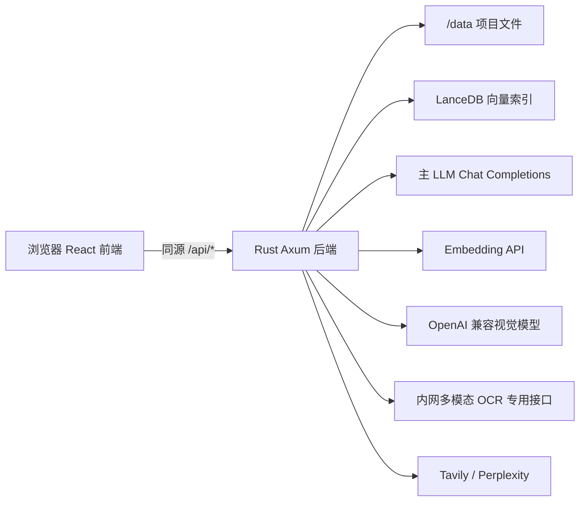

# LLM Wiki 前后端 API 接口说明

> 适用版本：`llm-wiki:0.5.0-linux-amd64`
>
> 文档日期：2026-06-30
>
> 后端：Rust + Axum
>
> 前端：React + TypeScript

## 1. 整体架构



生产 Web 模式下，前端和后端由同一个 Rust 服务提供：

- 页面：`http://服务器IP:8231/`
- API 前缀：`http://服务器IP:8231/api`
- 前端统一使用相对地址 `/api/*`，避免跨域和 Mixed Content。

## 2. 通用约定

### 2.1 数据格式

| 类型 | 约定 |
|---|---|
| 普通请求 | `application/json` |
| 文件上传 | `multipart/form-data` |
| LLM 流式输出 | `text/event-stream`，SSE |
| 图片、媒体 | 二进制响应，按扩展名设置 `Content-Type` |
| API 最大请求体 | `200 MB` |
| 通用前端 JSON 超时 | `30 秒` |
| 文件上传超时 | `5 分钟` |
| 后端调用外部模型超时 | `5 分钟` |

所有响应都增加：

```http
Cache-Control: no-store, no-cache, must-revalidate, max-age=0
```

### 2.2 错误格式

大部分 Rust handler 的内部错误统一返回：

```json
{
  "error": "错误详情"
}
```

当前通用错误转换器会将多数文件、数据库和内部异常映射为 `500 Internal Server Error`。部分专用接口会返回更准确的状态码：

- `400`：参数校验失败。
- `401`：未登录或用户名密码错误。
- `409`：用户名已存在。
- `502`：外部模型或搜索服务调用失败。
- `503`：模型服务未配置。

### 2.3 CORS 与鉴权现状

- 后端当前允许任意 Origin 的 `GET/POST/OPTIONS`。
- 注册登录通过 HttpOnly Cookie `llm_wiki_session` 保存 JWT，会话有效期 7 天。
- Cookie 属性：`HttpOnly; Path=/; SameSite=Lax`。
- **当前只有前端页面做登录门禁，文件、项目、模型和向量等业务 API 没有 JWT 中间件保护。**

因此当前版本只适合受控内网。接入生产网关前，应增加后端统一鉴权、HTTPS、来源限制和访问审计。

## 3. 前端调用位置

| 前端文件 | 负责的 API |
|---|---|
| `src/commands/api-client.ts` | 文件、项目、上传、向量接口的统一封装 |
| `src/commands/fs.ts` | 对 `api-client.ts` 的兼容性重导出 |
| `src/stores/auth-store.ts` | 注册、登录、退出、当前用户 |
| `src/lib/server-config.ts` | 获取服务端模型配置 `/api/config` |
| `src/components/chat/chat-panel.tsx` | 项目问答 `/api/chat/stream`、RAG 状态 |
| `src/lib/llm-client.ts` | 主 LLM 与 OpenAI 兼容视觉模型代理 |
| `src/lib/embedding.ts` | Embedding 代理 |
| `src/lib/web-search.ts` | Web Search 代理 |

前端通用 JSON 客户端会读取 `{error}` 或 `{message}`；请求超过 30 秒会主动中止。上传接口有独立的 5 分钟超时。

## 4. API 总览

当前后端共注册 46 条 `/api` 路由。

| 分组 | 数量 | 前缀 |
|---|---:|---|
| 健康与配置 | 2 | `/api/health`、`/api/config` |
| 文件系统 | 13 | `/api/fs/*` |
| 项目 | 4 | `/api/project/*` |
| 上传 | 2 | `/api/upload/*` |
| 产品批量导入 | 7 | `/api/ingest/product-batches*` |
| 向量索引 | 7 | `/api/vector/*` |
| RAG 与问答 | 3 | `/api/rag/*`、`/api/chat/*` |
| 模型代理 | 3 | `/api/llm/*` |
| Web 搜索 | 1 | `/api/search/*` |
| 认证 | 4 | `/api/auth/*` |

## 5. 健康与配置

### 5.1 `GET /api/health`

响应：

```json
{
  "status": "ok",
  "service": "llm-wiki"
}
```

该接口只表示 Web 服务可用，不会探测 LLM、OCR、Embedding 等外部服务。

### 5.2 `GET /api/config`

返回服务端托管配置，不返回真实 API Key：

```json
{
  "llm": {
    "provider": "custom",
    "has_api_key": true,
    "model": "minimax-m2.5",
    "endpoint": "http://llm-host:8999/v1",
    "api_mode": "chat_completions",
    "max_context_size": 198000
  },
  "embedding": {
    "endpoint": null,
    "model": null,
    "has_api_key": false
  },
  "vision": {
    "endpoint": null,
    "model": null,
    "has_api_key": false
  },
  "pdf": {
    "dpi": 150,
    "ocr_mode": "auto"
  },
  "search": {
    "provider": null,
    "has_api_key": false
  },
  "allow_user_override": false
}
```

**已知缺口：当前响应没有输出 `OCR_ENDPOINT` 是否已配置。** 内网 OCR 应通过以下方式确认：

```bash
docker exec llm-wiki printenv OCR_ENDPOINT
docker logs llm-wiki 2>&1 | grep "PDF OCR"
```

## 6. 认证接口

用户文件存储在：

```text
/data/.auth/users.json
```

### 6.1 `POST /api/auth/register`

请求：

```json
{
  "username": "admin01",
  "password": "secret123",
  "confirm_password": "secret123"
}
```

规则：用户名 3～32 个字符，只允许字母、数字、`_`、`-`；密码至少 6 位。

成功：`201 Created`

```json
{
  "id": "uuid",
  "username": "admin01"
}
```

同时写入 `Set-Cookie: llm_wiki_session=...`。

常见错误：

- `400`：用户名、密码或确认密码不符合规则。
- `409`：用户名已存在。
- `500 Failed to save user`：通常是 `/data` 不可写。

### 6.2 `POST /api/auth/login`

请求：

```json
{
  "username": "admin01",
  "password": "secret123"
}
```

成功返回 `{id, username}` 并设置 Cookie；失败返回 `401`。

### 6.3 `POST /api/auth/logout`

无请求体要求。响应：

```json
{ "ok": true }
```

### 6.4 `GET /api/auth/me`

浏览器携带会话 Cookie。已登录返回 `{id, username}`，否则返回 `401`。

## 7. 项目接口

| 方法与路径 | 请求 | 响应 | 说明 |
|---|---|---|---|
| `GET /api/project/list` | 无 | `[{name,path}]` | 枚举 `WIKI_DATA_PATH` 下的目录 |
| `POST /api/project/open` | `{"path":"/data/black"}` | `{name,path}` | 打开已有项目，目录不存在时失败 |
| `POST /api/project/create` | `{"name":"black","path":"/data/black"}` | `{name,path}` | 按指定绝对路径创建 |
| `POST /api/project/create-auto` | `{"name":"black"}` | `{name,path}` | 在 `WIKI_DATA_PATH` 下自动创建 |

项目初始化会创建常用 `wiki/*`、`raw/sources` 和 `.llm-wiki/lancedb` 目录，并写入 `project.json`。

## 8. 上传接口

### 8.1 `POST /api/upload/file`

请求：`multipart/form-data`

| 字段 | 类型 | 说明 |
|---|---|---|
| `file` | binary | 单个文件 |
| `destination_dir` | string | `/data` 下的目标目录 |

响应：

```json
{
  "path": "/data/black/raw/sources/demo.pdf",
  "name": "demo.pdf",
  "size": 123456
}
```

### 8.2 `POST /api/upload/files?dest=...`

请求：`multipart/form-data`，多个文件均使用字段名 `files`。`dest` 查询参数优先，multipart 中的 `destination_dir` 作为兼容兜底。

响应为逐文件结果数组：

```json
[
  { "path": "/data/black/raw/sources/a.pdf", "name": "a.pdf", "size": 100 },
  { "error": "File type '.exe' is not allowed", "name": "b.exe" }
]
```

限制：

- 单文件最大 `200 MB`。
- 文件名会剥离目录部分，防止利用文件名路径穿越。
- 目标目录必须位于 `WIKI_DATA_PATH` 下。
- 上传成功只代表文件已保存；知识抽取队列由浏览器前端继续编排。

## 9. 文件系统接口

### 9.1 路由表

| 方法与路径 | 请求 | 响应 | 说明 |
|---|---|---|---|
| `POST /api/fs/read` | `{"path":"..."}` | string | 读取并解析文件；PDF 会进入专用 OCR/文字层流程 |
| `POST /api/fs/write` | `{"path":"...","contents":"..."}` | `null` | 自动创建父目录并写文本 |
| `POST /api/fs/list` | `{"path":"..."}` | `FileNode[]` | 递归列目录 |
| `POST /api/fs/exists` | `{"path":"..."}` | boolean | 判断文件或目录是否存在 |
| `POST /api/fs/delete` | `{"path":"..."}` | `null` | 删除文件或递归删除目录 |
| `POST /api/fs/mkdir` | `{"path":"..."}` | `null` | 递归创建目录 |
| `POST /api/fs/copy` | `{"source":"...","destination":"..."}` | `null` | 复制单文件 |
| `POST /api/fs/copy-dir` | 同上 | `string[]` | 递归复制目录并返回目标文件路径 |
| `POST /api/fs/preprocess` | `{"path":"..."}` | string | 同步预处理读取；不走专用异步 OCR 优先链路 |
| `POST /api/fs/read-base64` | `{"path":"..."}` | `{base64,mimeType}` | 图片/PDF 转 Base64 |
| `POST /api/fs/related-wiki-pages` | `{"projectPath":"...","sourceName":"..."}` | `string[]` | 查找正文中引用指定来源的 Markdown |
| `GET /api/fs/media?path=...` | Query | binary | 返回图片、媒体或 PDF |
| `GET /api/fs/clip-server-status` | 无 | `"disabled"` | Web/Docker 模式固定禁用 |

`FileNode`：

```json
{
  "name": "product_catalog",
  "path": "/data/black/wiki/product_catalog",
  "is_dir": true,
  "children": []
}
```

### 9.2 PDF 解析顺序

`POST /api/fs/read` 读取 PDF 时：

1. 配置了 `OCR_ENDPOINT`：优先调用内网多模态 OCR 专用接口。
2. OCR 失败或未配置：尝试 Rust `pdf-extract`。
3. 文字层不可用：尝试 Poppler `pdftotext`。
4. 仍不可用：使用 `pdftoppm` 转页面图像，由前端 OpenAI 兼容视觉链路处理。

判断是否调用内网 OCR：

```bash
docker logs -f llm-wiki 2>&1 | grep -E "PDF OCR|pdf-extract|pdftotext|pdf-ocr"
```

成功日志：

```text
PDF OCR: calling internal OCR API for /data/...pdf
PDF OCR: success, 12345 chars
```

### 9.3 `fs/list` 目录不存在

当前 `fs/list` 对不存在的目录返回：

```json
{ "error": "No such file or directory (os error 2)" }
```

状态码为 `500`。例如首次抽取前 `wiki/product_catalog` 尚未生成时，知识树轮询可能看到该错误；前端会捕获并显示空列表，一般不影响 OCR 和抽取。建议后续改为 `200 []`，并在项目初始化时创建 `wiki/product_catalog`。

## 10. 向量接口

### 10.1 `POST /api/vector/upsert-chunks`

请求：

```json
{
  "project_path": "/data/black",
  "page_path": "wiki/product_catalog/demo.md",
  "page_title": "示例产品",
  "chunks": [
    {
      "chunk_index": 0,
      "heading_path": "产品信息 > 投保规则",
      "chunk_text": "正文片段",
      "vector": [0.1, 0.2, 0.3]
    }
  ]
}
```

响应为写入 chunk 数量。向量维度必须一致，且必须与项目现有索引维度一致。

### 10.2 其他向量路由

| 方法与路径 | 请求 | 响应 |
|---|---|---|
| `POST /api/vector/search-chunks` | `{project_path,query_vector,limit?,filter_expr?}` | 命中 chunk 数组，包含 `distance`、`score` |
| `POST /api/vector/delete-page` | `{project_path,page_path}` | 当前固定返回 `0` |
| `POST /api/vector/count-chunks` | `{project_path}` | chunk 数量 |
| `POST /api/vector/drop-legacy` | `{project_path}` | `null`，删除表和元数据 |
| `GET /api/vector/meta?project_path=...` | Query | `{dim,model}` 或 `null` |
| `POST /api/vector/update-meta` | `{project_path,model}` | `{dim,model}` |

`vector/meta` 与 `vector/update-meta` 已注册，但当前 React 前端没有对应的统一客户端封装。

## 11. RAG 与问答接口

### 11.1 `POST /api/rag/retrieve`

请求：

```json
{
  "project_path": "/data/black",
  "query": "最低投保年龄是多少？",
  "top_k": 8,
  "context_budget_tokens": 12000,
  "use_token": true,
  "use_graph": true
}
```

响应：

```json
{
  "chunks": [
    {
      "page_path": "wiki/product_catalog/demo.md",
      "page_title": "示例产品",
      "chunk_index": 0,
      "heading_path": "投保规则",
      "chunk_text": "...",
      "distance": 0.12,
      "score": 0.88,
      "source": "vector"
    }
  ],
  "retrieval_ms": 25,
  "query_len": 10,
  "top_k": 8,
  "context_budget_tokens": 12000
}
```

检索链路包括向量检索、Token/BM25 风格检索、标题与路径增强、图谱扩展和 RRF 融合。

### 11.2 `GET /api/rag/status?project_path=...`

返回索引状态：

```json
{
  "indexed": true,
  "chunk_count": 100,
  "dim": 1024,
  "embedding_model": "model-name",
  "schema_version": 2,
  "retrieval_mode": "hybrid_vector_chunk_page_graph_schema_rrf",
  "token_cache_loaded": true,
  "needs_reindex": false,
  "reason": null
}
```

### 11.3 `POST /api/chat/stream`

这是当前项目问答的主接口：后端完成 RAG、Prompt 组装并调用主 LLM。

请求：

```json
{
  "project_path": "/data/black",
  "messages": [
    { "role": "user", "content": "最低投保年龄是多少？" }
  ],
  "top_k": 8,
  "max_history_messages": 12,
  "temperature": 0.2,
  "max_tokens": 1600,
  "top_p": 0.9,
  "model": "minimax-m2.5",
  "stream": true
}
```

响应为 SSE。第一个事件是检索元数据：

```text
event: meta
data: {"type":"chat_meta","retrieval_query":"...","retrieval_ms":25,"top_k":8,"sources":[...]}
```

后续内容直接转发上游 OpenAI 兼容流，结束标记通常为 `data: [DONE]`。

## 12. 模型代理接口

### 12.1 `POST /api/llm/stream`

用途：抽取、知识治理和非项目问答等主 LLM 请求。

请求：

```json
{
  "messages": [{ "role": "user", "content": "..." }],
  "temperature": 0.2,
  "max_tokens": 4000,
  "top_p": 0.9,
  "model": "可选覆盖"
}
```

后端实际调用：

```text
POST {LLM_ENDPOINT}/chat/completions
Authorization: Bearer {LLM_API_KEY}
```

响应为原样转发的 SSE。

### 12.2 `POST /api/llm/vision-stream`

用于 **OpenAI Chat Completions 兼容**的视觉模型。请求结构与 `/llm/stream` 相同，但 `messages[].content` 可包含图片块；后端转换为：

```json
{
  "type": "image_url",
  "image_url": {
    "url": "data:image/jpeg;base64,..."
  }
}
```

后端实际调用：

```text
POST {VISION_ENDPOINT}/chat/completions
```

该接口需要 `VISION_ENDPOINT` 和 `VISION_MODEL`。它与内网 `/local_file_parser` 专用 OCR 协议不同。

### 12.3 `POST /api/llm/embed`

请求：

```json
{ "input": "需要生成向量的文本" }
```

后端直接向 `EMBEDDING_ENDPOINT` POST。标准接口请求为：

```json
{
  "model": "embedding-model",
  "input": "需要生成向量的文本"
}
```

响应保持 OpenAI Embeddings 格式。DashScope 多模态 Embedding 会在后端转换请求和归一化响应。

## 13. 内网多模态 OCR 外部契约

内网 OCR 底层是多模态模型，但使用专用 multipart 协议，因此必须配置 `OCR_ENDPOINT`，不能只配置 `VISION_ENDPOINT`。

环境变量：

```env
OCR_ENDPOINT=http://ocr-host/local_file_parser
OCR_USER_TEXT=识别文件中的所有文字
OCR_ACTION_SCENARIO=111
```

当前内网接口不需要 Key。

请求：

```http
POST {OCR_ENDPOINT}
Content-Type: multipart/form-data
```

| 字段 | 类型 | 说明 |
|---|---|---|
| `file` | binary | PDF、JPG、PNG 或 WebP |
| `user_text` | string | 默认“识别文件中的所有文字” |
| `action_scenario` | string | 默认 `111` |

响应：

```json
{
  "code": 0,
  "message": "操作成功",
  "data": {
    "trace_id": "可选",
    "robot_text": "识别出的完整文本"
  }
}
```

后端要求 `code=0` 且 `data.robot_text` 非空，否则记录失败并降级到本地 PDF 解析。

## 14. Web 搜索接口

### `POST /api/search/web`

请求：

```json
{
  "provider": "tavily",
  "api_key": "__SERVER_MANAGED__",
  "query": "搜索内容",
  "max_results": 10
}
```

`provider` 支持 `tavily`、`perplexity`。`api_key` 为空或为 `__SERVER_MANAGED__` 时使用服务端 `SEARCH_API_KEY`。

响应：

```json
[
  {
    "title": "结果标题",
    "url": "https://example.com",
    "snippet": "结果摘要",
    "source": "example.com"
  }
]
```

## 15. 主要业务调用链

### 15.1 PDF 上传与知识抽取

```text
浏览器选择 PDF
  -> POST /api/upload/file(s) 保存到 /data/{project}/raw/sources
  -> 前端 ingest queue 调用 POST /api/fs/read
  -> 后端优先调用 OCR_ENDPOINT
  -> 前端通过 POST /api/llm/stream 调用主 LLM 抽取
  -> POST /api/fs/write 写入 wiki/*.md
  -> POST /api/llm/embed 生成向量
  -> POST /api/vector/upsert-chunks 写入 LanceDB
```

注意：通用 `/api/upload/*` 仍由浏览器前端编排抽取；产品库批量导入应使用第 18 节的 `/api/ingest/product-batches*`，由后端自动执行抽取。

### 15.2 项目知识问答

```text
浏览器提问
  -> POST /api/chat/stream
  -> 后端 RAG 混合检索
  -> 读取命中 Markdown
  -> 调用 {LLM_ENDPOINT}/chat/completions
  -> SSE 返回来源元数据和答案 Token
```

## 16. 当前已知问题与建议

### 高优先级

1. **业务 API 没有后端鉴权。** 登录仅控制前端页面，知道地址的客户端仍可直接调用文件、项目和模型接口。
2. **文件路径保护不完整。** 当前只有 `fs/write`、`fs/delete` 和上传目录做了明确约束；`read/list/exists/mkdir/copy/media` 等接口没有统一执行 `guard_path`。
3. **CORS 完全开放。** 应改为部署域名白名单，并配合网关认证。
4. **认证强度有限。** 密码当前为 salt + SHA-256，JWT secret 由数据目录路径推导；生产应改为 Argon2/bcrypt 和独立 `JWT_SECRET`。

### 功能与可观测性

1. `/api/config` 未返回 `ocr_endpoint_configured`，无法从前端页面确认专用 OCR 是否启用。
2. `/api/fs/list` 对不存在目录返回 `500`，应改为 `200 []` 或明确的 `404`。
3. 通用错误转换器将大量参数、路径和文件错误统一映射为 `500`，不利于监控和前端提示。
4. `/api/vector/meta`、`/api/vector/update-meta` 缺少前端统一封装。
5. `api-client.ts` 注释仍写 FastAPI，实际生产后端已是 Rust Axum。
6. 建议在抽取活动面板记录 `internal_ocr / pdf_extract / pdftotext / vision_ocr`，避免只能通过容器日志判断解析路径。

## 17. 常用检查命令

```bash
# 服务健康
curl -s http://127.0.0.1:8231/api/health

# 服务端模型配置（不返回真实 Key）
curl -s http://127.0.0.1:8231/api/config

# 专用 OCR 环境变量
docker exec llm-wiki printenv OCR_ENDPOINT

# PDF 解析路径
docker logs -f llm-wiki 2>&1 | grep -E "PDF OCR|pdf-extract|pdftotext|pdf-ocr"

# RAG 索引状态
curl -s "http://127.0.0.1:8231/api/rag/status?project_path=/data/black"

# 最近服务日志
docker logs --tail 200 llm-wiki
```

## 18. 产品批量导入 API

该组接口同时服务于前端手动上传和外部批处理系统。一个批次对应一个保险产品；批量处理 1000 个产品时，由调用方为每个产品创建独立批次。不同项目可以并行处理，同一项目内串行抽取，避免同时改写相同 Markdown 和索引。

### 18.1 参数职责

| 参数 | 必填 | 说明 |
|---|---:|---|
| `project_name` | 是 | 前端创建项目时的名称，全局共享，不按用户隔离；名称必须能唯一定位项目 |
| `product_name` | 是 | 保险产品名称，同时作为产品源文件目录名 |
| `insurance_category` | 是 | 保险分类，当前支持医疗险、重疾险、意外医疗险、意外险、寿险、年金险 |
| `product_code` | 否 | 外部系统的产品编码 |
| `client_batch_id` | 否 | 调用方幂等键，重复提交返回已有批次 |
| `duplicate_policy` | 否 | `reject` 或 `merge`，默认 `merge`；版本化导入作为后续能力单独设计 |
| `relative_path` | 否 | 文件在产品文件夹内的相对路径，用于保留子目录结构 |
| `document_type` | 否 | 调用方已知时可传的文档类型提示，不传不影响处理 |

调用方不传字段级抽取规则。后端根据 `insurance_category`、文件扩展名/MIME、文件名、目录上下文以及可选的 `document_type` 选择 OCR、预处理和产品字段抽取规则，保证前端上传与接口导入使用同一套规则。

QA 与产品特色使用更严格的文档级路由：QA 只从文件名明确属于 QA/Q&A/FAQ/产品问答/常见问答的文件抽取；产品特色只从产品说明书、产品介绍书、产品简介或产品手册抽取。其它文件不会为这两个字段补值。产品别称抽取成功后会同步为所有该产品 Markdown 的 `aliases` frontmatter，供检索直接使用。

### 18.2 创建批次

```http
POST /api/ingest/product-batches
Content-Type: application/json
```

```json
{
  "project_name": "dww",
  "product_name": "平安福2026",
  "insurance_category": "重疾险",
  "product_code": "PAF-2026",
  "client_batch_id": "erp-20260630-0001",
  "duplicate_policy": "merge"
}
```

响应包含后续接口使用的 `batch_id`，初始状态为 `uploading`。

### 18.3 逐文件流式上传

```http
POST /api/ingest/product-batches/{batch_id}/files?relative_path=条款/主条款.pdf&document_type=保险条款
Content-Type: multipart/form-data

file: <binary>
```

每次请求上传一个文件，单文件上限 200 MB。服务端边接收边落盘并计算 SHA-256，不把整个文件读入内存。调用方可并发上传同一批次的多个文件；前端默认并发数为 4。

### 18.4 启动、查询和重试

| 方法 | 路径 | 说明 |
|---|---|---|
| `POST` | `/api/ingest/product-batches/{batch_id}/start` | 生成产品 manifest 并提交后台抽取，返回 `202` |
| `GET` | `/api/ingest/product-batches/{batch_id}` | 查询批次状态、错误、告警和已写入 Markdown |
| `GET` | `/api/ingest/product-batches?project_name=dww&limit=50` | 查询项目最近批次 |
| `POST` | `/api/ingest/product-batches/{batch_id}/retry` | 重试失败批次，复用已上传文件 |
| `GET` | `/api/ingest/product-batches/events?project_name=dww` | SSE 状态事件；前端在完成后自动刷新知识树 |

状态流转：`uploading -> ready -> queued -> processing -> completed`；任何后台错误进入 `failed`，并在 `error` 字段返回可诊断信息。

### 18.5 推荐的外部批处理流程

1. 创建或确认目标项目，并保证 `project_name` 唯一。
2. 每个产品调用一次创建批次接口，传产品名称和保险分类。
3. 对该产品目录下的文件逐个调用上传接口，保留 `relative_path`。
4. 所有文件成功上传后调用 `start`；不要在文件仍上传时提前启动。
5. 轮询批次详情或监听 SSE，失败时记录 `error` 并调用 `retry`。
6. `completed` 后，生成的 Markdown 会出现在现有 `wiki/product_catalog` 页面中，前端无需另做数据同步。
